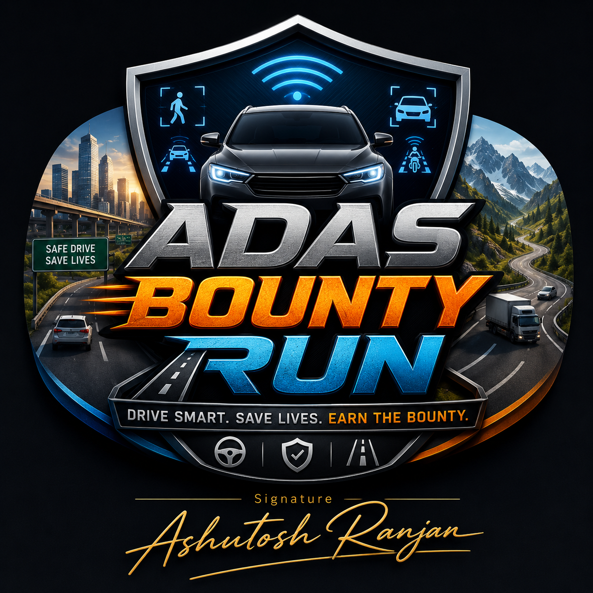

<div align="center">



# ADAS Bounty Run
### Drive Smart. Save Lives. Earn the Bounty.

A cinematic driving‑survival game for **Android** that teaches how **Advanced Driver
Assistance Systems (ADAS)** prevent accidents. Drive increasingly difficult routes
while pedestrians, vehicles, animals, cyclists and hazards appear dynamically — earn
bounty for safe, rule‑abiding driving and correct ADAS use; lose it for collisions,
speeding and reckless behaviour. Cause an accident and the police give chase.

*Signature — Ashutosh Ranjan*

</div>

---

## 1. What this is

The master specification targets a full Unity 6 production. This repository delivers a
**native, buildable Android application** that implements the specified **Minimum Viable
Product (spec §22)** as a self‑contained Kotlin game — no engine license, no asset store,
runs on a phone. The architecture mirrors the spec's manager/interface design so systems
map 1:1 onto the documented vision and remain easy to extend (and to port to Unity later).

The game uses a custom **pseudo‑3D renderer** (perspective‑projected road + sprites drawn
on a `SurfaceView`) and a fixed‑step game loop, so the whole simulation — vehicle physics,
ADAS perception, traffic/pedestrian/animal AI, police pursuit, bounty and reporting — is
real, testable code rather than placeholders.

> **ADAS assists the driver. It does not replace attentive and responsible driving.**

## 2. Implemented features (MVP, spec §22)

| Area | Status |
|------|--------|
| Realistic player car with custom physics + damage model | ✅ |
| India country profile · left‑side traffic · RHD | ✅ (10 countries registered) |
| Highway & City environments | ✅ (9 environment types defined) |
| Pedestrian / Vehicle / Cyclist / Animal detection | ✅ |
| FCW · AEB · LDW · LKA · ACC · BSM · TSR · DMS · ESA | ✅ |
| Bounty system (fully data‑driven scoring) | ✅ |
| 10 levels · +10 km/h per level · difficulty ramp | ✅ |
| Vehicle & sensor damage affecting ADAS | ✅ |
| Police chase · 5‑tier wanted system | ✅ |
| End‑of‑level ADAS report · S–F grade | ✅ |
| First/third‑person pseudo‑3D camera + HUD | ✅ |
| Day/night + weather (grip/visibility/sensor effects) | ✅ |
| Sensor visualisation (engineering overlay) | ✅ |
| Spoken ADAS voice alerts (TTS) + haptics | ✅ |
| Animated branded splash / loading screen | ✅ |
| Unit test suite (25 tests) | ✅ |

## 3. Build & run

**Requirements:** Android Studio (Koala+), Android SDK 34, JDK 17.

```bash
# From the project root
./gradlew assembleDebug          # build the APK
./gradlew installDebug           # install on a connected device/emulator
./gradlew testDebugUnitTest      # run the JVM unit tests
```

Or open the folder in Android Studio and press **Run**. The app targets **landscape**;
use an emulator/device on API 26+.

> The game‑logic unit tests are pure‑JVM and run without the Android SDK. They are
> verified passing (`OK (25 tests)`).

## 4. How to play

- **Steer:** ◄ / ► buttons (bottom‑left) · **Accelerate:** GAS · **Brake:** BRAKE (bottom‑right).
- **SENSORS** toggles the engineering perception overlay; **VOICE** toggles spoken alerts; **II** pauses.
- Keep a safe distance, respect the speed limit, and react to ADAS warnings. Let **AEB** help
  when a collision is imminent. Avoid pedestrians, cyclists and animals to earn bounty.
- Cause an accident and police pursue you — **stop safely to cooperate** (recommended) or flee
  (heavy, continuous bounty penalty; never rewarded).
- Clear the level's distance to see your **ADAS Safety Report** and advance (+10 km/h).

See **[docs/PLAYER_GUIDE.md](docs/PLAYER_GUIDE.md)** for full scoring and grades.

## 5. Project structure

```
app/src/main/java/com/adas/bountyrun/
├── config/     Data-driven configuration (Country, Environment, Vehicle, ADAS, Scoring, Levels)
├── core/       Managers & interfaces (GameSession, Bounty, Level, Wanted, Report)
├── engine/     Simulation core (GameWorld, GameView loop, Renderer, Spawner, Collision, Police, pooling)
├── entities/   PlayerCar, RoadEntity (traffic/VRU/animal/hazard), PoliceCar
├── adas/       SensorModel + AdasManager (FCW/AEB/ACC/LDW/LKA/BSM/DMS/ESA/TSR)
├── audio/      VoiceManager (spoken alerts via TTS)
└── ui/         SplashActivity, MenuActivity, GameActivity, ReportActivity
app/src/test/   JVM unit tests (bounty, level progression, wanted/report, physics/sensor/collision)
docs/           Architecture, developer guide, player guide, asset integration
```

## 6. Documentation

- **[docs/TECHNICAL_ARCHITECTURE.md](docs/TECHNICAL_ARCHITECTURE.md)** — complete technical reference: design patterns, dependency injection, data‑flow / class / sequence diagrams, internal API details, Unity‑mapping, and UI/UX + animation snippets.
- **[docs/ARCHITECTURE.md](docs/ARCHITECTURE.md)** — system & data‑flow diagrams, class responsibilities, interfaces, sequences.
- **[docs/DEVELOPER_GUIDE.md](docs/DEVELOPER_GUIDE.md)** — how to extend countries/vehicles/ADAS/scoring, tuning, testing, Unity‑migration notes.
- **[docs/PLAYER_GUIDE.md](docs/PLAYER_GUIDE.md)** — controls, modes, scoring, grades.
- **[docs/ASSET_INTEGRATION.md](docs/ASSET_INTEGRATION.md)** — using the exact logo artwork and adding 3D models / audio.

## 7. Branding

The launcher icon and splash use a branded **shield emblem** vector plus the styled
`ADAS BOUNTY RUN` wordmark (Android vector drawables cannot embed text, so the wordmark is
composed with styled views). To use the **exact supplied logo image**, drop it at
`app/src/main/res/drawable-nodpi/logo.png` and follow **[docs/ASSET_INTEGRATION.md](docs/ASSET_INTEGRATION.md)**.

## 8. Safety & ethics (spec §26)

The game never rewards harming pedestrians, hit‑and‑run behaviour or reckless escapes,
and uses non‑graphic, responsible treatment of incidents. After serious incidents it shows
educational messaging naming the ADAS feature that could have prevented the crash.

## 9. Licence

See [LICENSE](LICENSE).
