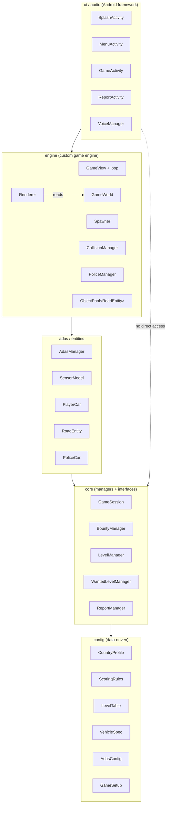
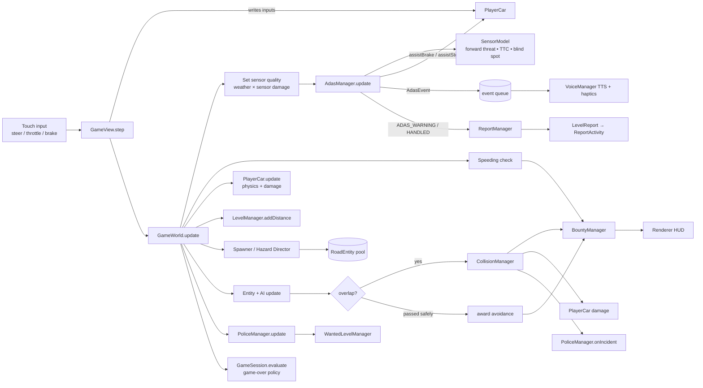
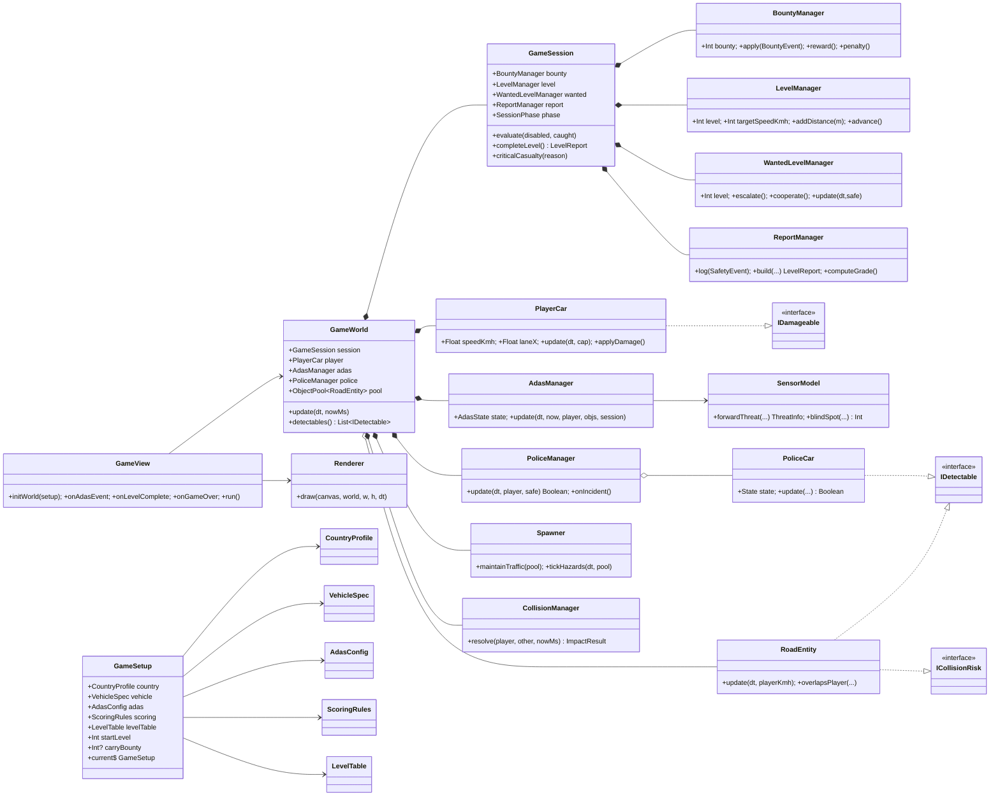
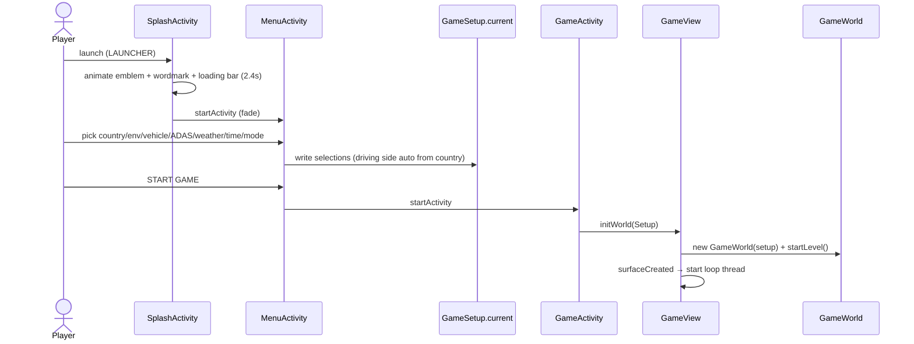
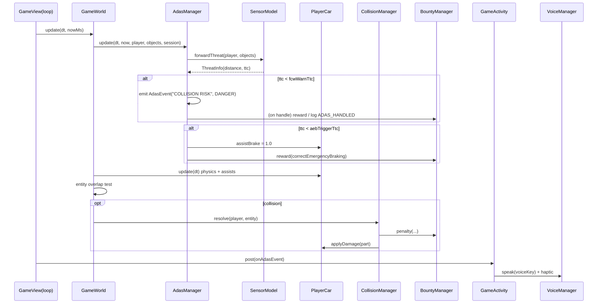
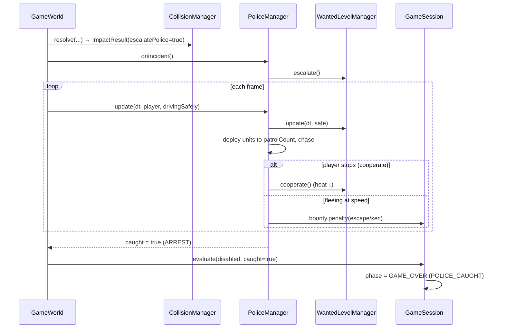
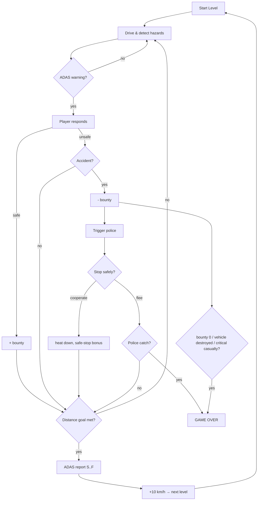
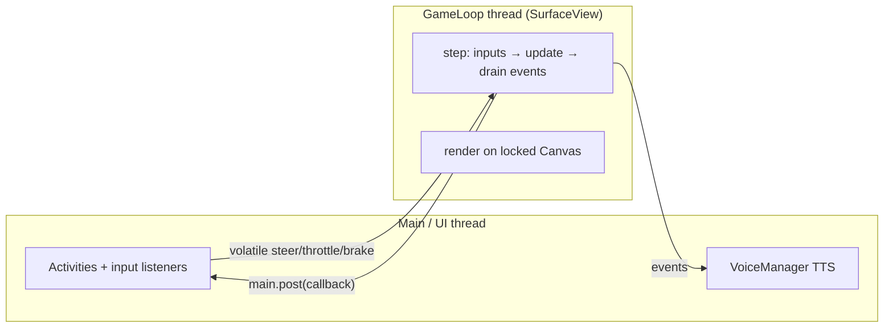

<div align="center">


# ADAS Bounty Run — Complete Technical Architecture

</div>

> **Scope.** This document is the authoritative engineering reference for the shipped
> application. It covers the architectural style, design patterns, dependency‑injection
> approach, data‑flow / sequence / class diagrams, the internal API surface, the honest
> position on the Unity engine, and annotated UI/UX + animation snippets.

---

## Table of contents

1. [Technology reality — Unity vs. native](#1-technology-reality--unity-vs-native)
2. [Architectural style & layers](#2-architectural-style--layers)
3. [Design patterns used](#3-design-patterns-used)
4. [Dependency injection](#4-dependency-injection)
5. [Data‑flow diagram](#5-dataflow-diagram)
6. [Class diagram](#6-class-diagram)
7. [Sequence diagrams](#7-sequence-diagrams)
8. [Gameplay flow](#8-gameplay-flow)
9. [Internal API details](#9-internal-api-details)
10. [Where & how the Unity engine fits](#10-where--how-the-unity-engine-fits)
11. [UI/UX & animation snippets](#11-uiux--animation-snippets)
12. [Threading & performance model](#12-threading--performance-model)

---

## 1. Technology reality — Unity vs. native

The master specification proposes **Unity 6 (URP/HDRP) + C#**. The shipped product is a
**native Android application written in Kotlin** with a **custom pseudo‑3D engine** built on
`SurfaceView` + `Canvas`. This is a deliberate, honest engineering decision:

| | Spec target | This build |
|---|---|---|
| Engine | Unity 6 | Custom loop on Android `SurfaceView` |
| Language | C# | Kotlin |
| Rendering | URP/HDRP 3D | Perspective‑projected 2.5D `Canvas` draw |
| Physics | Wheel colliders | Custom vehicle controller (`PlayerCar`) |
| Config | ScriptableObjects | Kotlin `data class` registries |
| Build output | Unity player | Standard Gradle APK |

**Unity is not a dependency of this application.** Section 10 documents exactly where Unity
would slot in and how each class maps onto Unity concepts, because the codebase is
intentionally shaped for that migration. Everywhere this document says “engine”, it means the
custom engine in `com.adas.bountyrun.engine`.

---

## 2. Architectural style & layers

The app is a **layered, single‑threaded‑simulation game architecture** with a strict
one‑way dependency rule: **UI → Engine → Core → Config**. Rendering is a **read‑only
projection** of simulation state (a CQRS‑like split: the loop writes, the renderer reads).



**Layer contracts**

- **config** — pure data, no behaviour, no Android. The single source of truth for every tunable.
- **core** — game rules & bookkeeping (score, level, wanted, report) behind small interfaces. No Android.
- **adas / entities** — perception, ADAS decision‑making, physics. No Android.
- **engine** — orchestration + rendering. Only `Renderer`/`GameView` touch Android (`Canvas`, `SurfaceView`).
- **ui / audio** — Android activities, input, TTS. Thin; delegates all logic downward.

Because config → adas/entities/engine(minus renderer) → core carry **no Android imports**, the
entire simulation compiles and unit‑tests on a plain JVM (25 tests, all passing).

---

## 3. Design patterns used

### 3.1 Facade / Mediator — `GameSession`
`GameSession` is the single hub (the spec’s “GameManager”). It composes the per‑run managers and
exposes coarse operations (`evaluate`, `completeLevel`, `criticalCasualty`) so the engine never
touches individual managers’ internals.

```kotlin
class GameSession(val setup: GameSetup) {
    val bounty = BountyManager(setup.scoring, startingOverride = setup.carryBounty)
    val level  = LevelManager(setup.levelTable, setup.startLevel)
    val wanted = WantedLevelManager()
    val report = ReportManager()

    fun evaluate(vehicleDisabled: Boolean, policeCaught: Boolean) { … }  // game-over policy
    fun completeLevel(): LevelReport { … }                               // bonuses + report
}
```

### 3.2 State machine — wanted level, police, session phase
Three explicit state machines drive game state:

- `SessionPhase { DRIVING, LEVEL_COMPLETE, GAME_OVER }`
- `WantedLevelManager.level ∈ 0..5` with `escalate() / cooperate() / update()` transitions.
- `PoliceCar.State { PURSUIT, INTERCEPT, CONTAINMENT, ARREST }`, chosen from the closing gap:

```kotlin
state = when {
    gap < 3.2f && abs(dx) < 0.6f -> State.ARREST
    gap < 9f  -> State.CONTAINMENT
    gap < 30f -> State.INTERCEPT
    else      -> State.PURSUIT
}
```

### 3.3 Object Pool — `ObjectPool<RoadEntity>`
Frequently spawned road users are pooled (spec §28) to eliminate per‑frame allocation. A free
item is one whose `active` flag is false.

```kotlin
class ObjectPool<T>(initialSize: Int, private val factory: () -> T, private val isActive: (T) -> Boolean) {
    fun obtain(): T {
        for (i in items.indices) if (!isActive(items[i])) return items[i]
        return factory().also { items.add(it) }   // grow on demand
    }
}
```

### 3.4 Strategy — behaviour & ADAS feature toggles
- `RoadEntity.Behavior { LANE_FOLLOW, ONCOMING, CROSSING, WANDER, STATIC }` selects the per‑entity
  AI strategy inside a single `update(dt, playerSpeedKmh)`.
- `AdasConfig.enabled: Set<AdasFeature>` turns each ADAS algorithm on/off at runtime; `AdasManager`
  branches on membership, so features compose without subclassing.

### 3.5 Data‑driven configuration (ScriptableObject‑equivalent)
Every number lives in an immutable `data class` registry — `ScoringRules`, `LevelTable`,
`CountryProfile`, `VehicleSpec`, `AdasConfig`. Changing balance never touches gameplay code:

```kotlin
data class ScoringRules(
    val startingBounty: Int = 10_000,
    val hittingPedestrian: Int = 5_000,
    val correctEmergencyBraking: Int = 350,
    /* … */
) { companion object { val DEFAULT = ScoringRules() } }
```

### 3.6 Component / entity interfaces
Small role interfaces (`IDetectable`, `IDamageable`, `ICollisionRisk`) decouple perception,
damage and scoring from concrete types — the spec’s interface set, verbatim.

### 3.7 Observer / callback
- `BountyManager.setListener((Int, BountyEvent) -> Unit)` notifies the HUD of score changes.
- `GameView` exposes `onAdasEvent`, `onLevelComplete`, `onGameOver` function‑type callbacks that the
  loop posts to the main thread — decoupling the simulation thread from Android UI.

### 3.8 Game‑loop pattern (fixed‑ish step with `dt` clamp)
A dedicated thread runs `input → update(dt) → render`, clamping `dt` for stall resilience.

### 3.9 Factory & Producer
`ObjectPool`’s `factory: () -> T` and `Spawner`’s `spawn*` producers centralise construction of
traffic, VRUs, animals and hazards (country‑weighted).

### 3.10 Singleton (scoped) — `GameSetup.current`
A single mutable setup object carries menu selections into the game without a DI container.

| Pattern | Primary classes |
|---|---|
| Facade / Mediator | `GameSession`, `GameWorld` |
| State machine | `WantedLevelManager`, `PoliceCar`, `SessionPhase` |
| Object Pool | `ObjectPool`, `RoadEntity` |
| Strategy | `RoadEntity.Behavior`, `AdasConfig`/`AdasFeature` |
| Data‑driven config | `ScoringRules`, `LevelTable`, `CountryProfile`, `VehicleSpec` |
| Component interfaces | `IDetectable`, `IDamageable`, `ICollisionRisk` |
| Observer / callback | `BountyManager` listener, `GameView` callbacks |
| Game loop | `GameView.run()` |
| Factory / Producer | `ObjectPool`, `Spawner` |
| Singleton (scoped) | `GameSetup.current` |

---

## 4. Dependency injection

The project uses **manual constructor injection** (a.k.a. “pure DI” / poor‑man’s DI). There is
**no Dagger/Hilt/Koin** — dependencies are small, the object graph is shallow, and a container
would add weight without benefit for a single‑screen game.

**Composition roots** (where the graph is assembled):

1. `MenuActivity` builds `GameSetup.current` from user selections.
2. `GameActivity.onCreate → gameView.initWorld(GameSetup.current)`.
3. `GameWorld`’s constructor wires the whole simulation graph from that one setup:

```kotlin
class GameWorld(val setup: GameSetup) {
    val session   = GameSession(setup)                     // owns Bounty/Level/Wanted/Report
    val player    = PlayerCar(setup.vehicle, setup.weather.gripFactor)
    val adas      = AdasManager(setup.adas)                // SensorModel injected (defaulted)
    private val collision = CollisionManager(session)
    val police    = PoliceManager(session)
    private val spawner   = Spawner(setup.country, session.level)
    val pool = ObjectPool(28, { RoadEntity() }, { it.active })
}
```

**Why this is clean DI, not service‑locator sprawl:**

- Every collaborator is passed **in via the constructor** (`session`, `setup`, `SensorModel`).
- Config objects are injected, so tests build a `GameSession(GameSetup())` or
  `BountyManager(customRules)` with zero framework and full control (see `GameLogicTest`).
- Seams for substitution exist where they matter, e.g. `AdasManager(config, sensor = SensorModel())`
  and `PoliceManager(session, rnd = Random(seed))` allow deterministic tests.

The only ambient state is the scoped singleton `GameSetup.current`, used purely as the
menu→game hand‑off; the game itself reads it **once** at construction.

---

## 5. Data‑flow diagram

One simulation frame, `GameWorld.update(dt, nowMs)` (order is significant — assists apply the
same frame they are computed):



---

## 6. Class diagram



---

## 7. Sequence diagrams

### 7.1 Launch → configure → start a level



### 7.2 Per‑frame ADAS → AEB → collision → score



### 7.3 Incident → police pursuit → game over



### 7.4 Level complete → report → next level

```mermaid
sequenceDiagram
    participant GW as GameWorld
    participant GS as GameSession
    participant RM as ReportManager
    participant GV as GameView
    participant Game as GameActivity
    participant Rep as ReportActivity

    GW->>GS: completeLevel()
    GS->>GS: award route + perfect bonuses (collision-conditional)
    GS->>RM: build(...) → LevelReport (grade S..F)
    GS-->>GW: LevelReport
    GV->>Game: post(onLevelComplete(report))
    Game->>Rep: startActivity (pendingReport)
    Rep->>Rep: render stats + grade + prevention insights
    Rep->>GameSetup: startLevel = level+1; carryBounty = remaining
    Rep->>Game: NEXT LEVEL → new GameActivity (+10 km/h)
```

---

## 8. Gameplay flow



---

## 9. Internal API details

There is **no network/REST API in the MVP** (the spec lists Firebase/Supabase as *optional*
future cloud backends — see §10 roadmap). “API” here means the **public in‑process contracts**
each module exposes. Key surfaces:

### Core interfaces (`core/Interfaces.kt`)
```kotlin
interface IDetectable { val worldZ:Float; val laneX:Float; val speedKmh:Float
                        val halfWidth:Float; val halfLength:Float; val active:Boolean; val kind:DetectKind }
interface ICollisionRisk { val kind:DetectKind; val hazardKind:HazardKind? }
interface IDamageable { fun applyDamage(amount:Float, part:DamagePart); val isDisabled:Boolean }

enum class DetectKind { VEHICLE, PEDESTRIAN, CYCLIST, ANIMAL, HAZARD, POLICE, EMERGENCY }
data class BountyEvent(val delta:Int, val reason:String, val critical:Boolean=false)
data class SafetyEvent(val type:SafetyType, val timeMs:Long, val detail:String="")
```

### Manager API (selected signatures)
```kotlin
// BountyManager
fun apply(event: BountyEvent): Int
fun reward(delta: Int, reason: String); fun penalty(delta: Int, reason: String)
val isDepleted: Boolean

// LevelManager
val targetSpeedKmh: Int                 // 30, 40, … +10 per level
fun addDistance(meters: Float): Boolean // true at goal
fun advance()

// WantedLevelManager
fun escalate(by: Int = 1); fun cooperate(); fun update(dt: Float, drivingSafely: Boolean)
val patrolCount: Int; val hasRoadblocks/ hasSpikeStrips/ hasHelicopter: Boolean

// GameSession
fun evaluate(vehicleDisabled: Boolean, policeCaught: Boolean)
fun completeLevel(): LevelReport
fun startNextLevel()

// AdasManager
val state: AdasState                    // severity, activeFeature, ttc, followingDistance, blindSpot…
val events: ArrayDeque<AdasEvent>       // drained by the view for voice/haptics
fun update(dt, nowMs, player, objects, session)

// SensorModel
fun forwardThreat(player, objects, playerSpeedKmh): ThreatInfo?
fun blindSpot(player, objects): Int     // -1 left, +1 right, 0 none

// GameView (engine ⇄ Android boundary)
var steerInput/ throttleInput/ brakeInput: Float
var onAdasEvent: ((AdasEvent)->Unit)?; var onLevelComplete: ((LevelReport)->Unit)?; var onGameOver: ((GameOverReason)->Unit)?
```

### Configuration registries (read APIs)
```kotlin
CountryProfile.ALL: List<CountryProfile>      // 10 countries
CountryProfile.byCode("IN"): CountryProfile   // India profile
VehicleSpec.ALL / .byId(id)
ScoringRules.DEFAULT ; LevelTable.DEFAULT
AdasConfig(enabled: MutableSet<AdasFeature>, thresholds…)
```

---

## 10. Where & how the Unity engine fits

**In the shipped app: nowhere — Unity is not used.** The section exists because the codebase is
purpose‑built to migrate to Unity 6 with minimal reshaping. The mapping:

| This build (Kotlin) | Unity 6 equivalent | Notes |
|---|---|---|
| `config/*` `data class` | **ScriptableObject** assets | 1:1 fields; author in the Inspector |
| `GameSession`, `*Manager` | **MonoBehaviour** services / singletons | logic ports as‑is (no Android/Canvas deps) |
| `PlayerCar.update(dt)` | `FixedUpdate()` + **WheelColliders** | swap custom longitudinal/lateral maths for Unity physics |
| `RoadEntity`, `PoliceCar` | **Prefabs** + components | same fields; `update` → `Update/FixedUpdate` |
| `SensorModel`, `AdasManager` | plain C# services | pure math — direct translation |
| `Renderer` (Canvas) | **URP/HDRP** cameras + `Cinemachine` | the only fully‑replaced layer |
| `Spawner` / Hazard Director | **NavMesh + object pooling** | keep the fairness rules |
| `ObjectPool<T>` | Unity Pool API | identical semantics |
| `IDetectable/IDamageable/ICollisionRisk` | C# interfaces (spec §20) | names already match |
| `VoiceManager` (TTS) | Audio Mixer + spatial `AudioSource` | replace TTS with recorded VO |

**Migration entry points**: start by porting `config` → ScriptableObjects, then `core` +
`adas` verbatim, then rebuild `engine`’s `Renderer`/`GameView` as Unity scenes/cameras. The
**optional cloud API** (spec: Firebase/Supabase) would attach at `ReportManager`/`GameSession`
boundaries to sync bounty, achievements and safety reports — no other layer changes.

---

## 11. UI/UX & animation snippets

### 11.1 Animated splash / loading (the logo animation)
The emblem scales in with an overshoot, gently rotates as a “loading” cue, the wordmark
staggers up, and a decelerating progress bar drives the transition — all with Android
property animators (no frame assets).

```kotlin
// Emblem: scale + fade in with a subtle overshoot.
emblem.alpha = 0f; emblem.scaleX = 0.6f; emblem.scaleY = 0.6f
emblem.animate().alpha(1f).scaleX(1f).scaleY(1f)
    .setInterpolator(OvershootInterpolator(1.2f)).setDuration(650).start()

// Continuous gentle pulse to read as "loading".
ObjectAnimator.ofFloat(emblem, "rotationY", 0f, 12f, 0f).apply {
    duration = 2200; repeatCount = ValueAnimator.INFINITE; start()
}

// Wordmark: staggered slide-up (ADAS → BOUNTY → RUN).
slideUp(adas, 250); slideUp(bounty, 400); slideUp(run, 520)

// Loading bar drives the transition to the menu.
ValueAnimator.ofInt(0, 100).apply {
    duration = 2200; interpolator = DecelerateInterpolator()
    addUpdateListener { bar.progress = it.animatedValue as Int }; start()
}
```
> Swap the emblem `ImageView`’s source for `@drawable/logo` (the raster in `res/drawable-nodpi/`)
> and the identical animation plays over the exact artwork — see `ASSET_INTEGRATION.md`.

### 11.2 Hold‑to‑act touch controls (UX)
Pedals and steering are momentary: press‑and‑hold applies input and dims the button; release
zeroes it. This gives analog‑feeling control from simple buttons.

```kotlin
private fun holdControl(id: Int, onState: (Boolean) -> Unit) {
    findViewById<View>(id).setOnTouchListener { v, e ->
        when (e.actionMasked) {
            MotionEvent.ACTION_DOWN -> { onState(true);  v.alpha = 0.7f; true }
            MotionEvent.ACTION_UP,
            MotionEvent.ACTION_CANCEL -> { onState(false); v.alpha = 1f; true }
            else -> false
        }
    }
}
// wiring
holdControl(R.id.btnGas)   { down -> gameView.throttleInput = if (down) 1f else 0f }
holdControl(R.id.btnBrake) { down -> gameView.brakeInput    = if (down) 1f else 0f }
```

### 11.3 Multimodal ADAS feedback (voice + haptics)
ADAS events are surfaced on three channels at once — colour band (HUD), spoken alert (TTS) and
vibration keyed to severity — matching real vehicle HMIs.

```kotlin
private fun onAdas(ev: AdasEvent) {
    voice.speak(ev.voiceKey)                                  // "Pedestrian detected", …
    if (ev.severity == WarningSeverity.DANGER) haptic(90)
    else if (ev.severity == WarningSeverity.HIGH) haptic(45)
}
```

### 11.4 HUD warning colour system (spec §16)
The HUD maps risk to the automotive green→yellow→orange→red band, driven by `AdasState.severity`:

```kotlin
private fun severityColor(s: WarningSeverity, alpha: Int) = when (s) {
    WarningSeverity.SAFE    -> Color.argb(alpha, 49, 208, 107)   // green
    WarningSeverity.CAUTION -> Color.argb(alpha, 245, 208, 32)   // yellow
    WarningSeverity.HIGH    -> Color.argb(alpha, 243, 144, 25)   // orange
    WarningSeverity.DANGER  -> Color.argb(alpha, 240, 54, 44)    // red
}
```

### 11.5 Pseudo‑3D perspective (rendering UX)
Depth comes from one projection function; every sprite and the road trapezoid scale by it, so
near objects are large/low and far objects shrink toward the horizon.

```kotlin
fun scaleAt(relZ: Float): Float = FOCAL / (FOCAL + relZ.coerceAtLeast(-FOCAL + 1f))
// screen Y interpolates horizon↔bottom by scale; sprite size ∝ scale
```

### 11.6 Menu UX — country drives everything
Selecting a country auto‑derives driving side and steering position (no separate step, spec §4):

```kotlin
setup.country = countries[position]
val side  = if (setup.country.drivingSide == DrivingSide.LEFT) "Left-hand traffic" else "Right-hand traffic"
val wheel = if (setup.country.rightHandDrive) "RHD" else "LHD"
findViewById<TextView>(R.id.tvDrivingSide).text = "$side • $wheel"
```

---

## 12. Threading & performance model



- **One simulation thread** owns all mutable game state; the UI thread only sets three
  `@Volatile` input floats and receives posted callbacks — no locks, no shared mutable collections.
- **`dt` clamp** (`if (dt > 0.05f) dt = 0.05f`) prevents tunnelling after a stall.
- **Object pooling** + cached `Paint`s + distance‑culled draw keep the hot path allocation‑free
  (spec §28). Target ~60 FPS with graceful degradation.

---

<div align="center">

*ADAS assists the driver. It does not replace attentive and responsible driving.*

</div>
